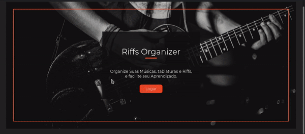
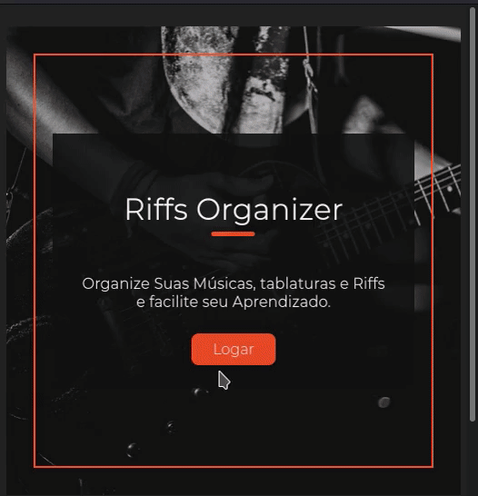

# Guitar Pratice APP :guitar:

Um Web APP que desenvolvi para ajudar no meu Hobby (toco Guitarra/baixo). Organizando músicas e tablaturas que estou estudando em um único lugar.

#### Demonstração:



#### Demonstração Mobile:



## Tecnologias

- JS
- React
- Styled Components
- API do Youtube
- React Router
- Json Web Token (JWT)

## Features

- Vídeos (Apenas YouTube): veja as músicas direto no app
- Loops: treine trechos especificos de músicas com os loops!
- CRUD Músicas (Vídeo, tablaturas e loops)
- Autenticação

## Instalando

Clone e instale a API [clicando aqui.](https://github.com/BrunoMendes41/GuitarPraticeOrganizerApi)

Clone o repositório e use o comando:

```bash
npm install
```

## Rodando o Projeto

Com a API e o banco de dados MONGOdb rodando

use o comando:

```bash
npm start
```

## Licença

[MIT](https://choosealicense.com/licenses/mit/)
