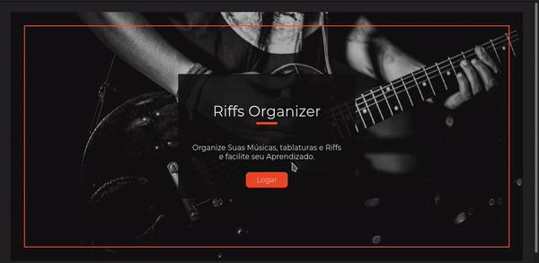

# Guitar Pratice APP

Um Web App em React para organizar as músicas e tablaturas.



## Tecnologias

- React
- Styled Components
- API do Youtube
- React Router

## Instalando

Clone e instale a API [clicando aqui.](https://github.com/BrunoMendes41/GuitarPraticeOrganizerApi)

Clone o repositório e use o comando:

```bash
npm install
```

## Rodando o Projeto

Com a API e o banco de dados MONGOdb rodando

use o comando:

```bash
npm start
```

## Licença

[MIT](https://choosealicense.com/licenses/mit/)
